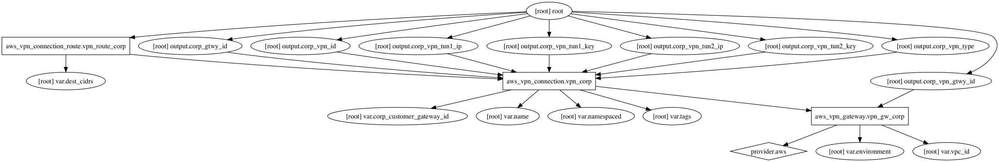

tf_vpn_corp Terraform Module
=====================

Setup VPN connection to Corporate

Usage:
------

    module "tf_vpn_corp" {
      source       = "../tf_vpn_corp"
      name         = ""
      environment  = "dev01"
      vpc_id       = ""
      dest_cidrs   = ""
    }

## Inputs

| Name | Description | Default | Required |
|------|-------------|:-----:|:-----:|
| corp_customer_gateway_id | Corporate Customer Gateway ID | - | yes |
| dest_cidrs | Destination CIDRS for building routes | - | yes |
| environment | Environment (ex: dev, qa, stage, prod) | - | yes |
| name | Name | - | yes |
| namespaced | Namespace all resources (prefixed with the environment)? | `true` | no |
| tags | A map of tags to add to all resources | `<map>` | no |
| vpc_id | AWS VPC ID | - | yes |

## Outputs

| Name | Description |
|------|-------------|
| corp_gtwy_id | Corporate Gateway ID |
| corp_vpn_gtwy_id | Corporate VPN Gateway ID |
| corp_vpn_id | Corporate VPN ID |
| corp_vpn_tun1_ip | Corporate VPN Tunnel 1 public IP |
| corp_vpn_tun1_key | Corporate VPN Tunnel 1 preshared key |
| corp_vpn_tun2_ip | Corporate VPN Tunnel 2 public IP |
| corp_vpn_tun2_key | Corporate VPN Tunnel 2 preshared key |
| corp_vpn_type | Corporate VPN connection type |

### Resource Graph

